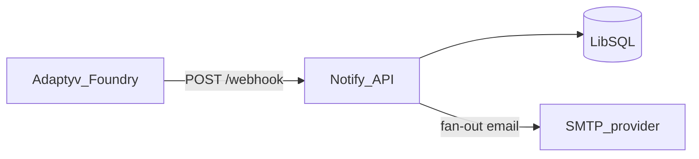

# Notify

**Notify** connects [Adaptyv Foundry](https://foundry.adaptyvbio.com) experiment webhooks to outbound notifications. Today it delivers **email** when an experiment reaches statuses you configure. A small dashboard handles destinations, per-status triggers, inbound webhook history, and per-destination delivery results.

The app was bootstrapped with [Better-T-Stack](https://github.com/AmanVarshney01/create-better-t-stack); this document focuses on product behavior, deployment, and known limitations.

## Stack

| Layer | Technology |
| --- | --- |
| Web | React, TanStack Router, Vite (`apps/web`) |
| API | Hono, tRPC (`apps/server` → `packages/api`) |
| Data | Drizzle ORM, LibSQL (`packages/db`) |
| Auth | Better Auth, email OTP (`packages/auth`) |
| Mail | Nodemailer (`packages/nodemailer`) |

## Architecture

Notify is **two deployables**: a Node HTTP API and a static SPA. The browser talks to the API via `VITE_SERVER_URL` (tRPC uses `{VITE_SERVER_URL}/trpc`).



1. Foundry calls `POST /webhook?token=…` with a JSON body.
2. The API validates the payload, stores a row in `webhook_events`, and responds.
3. `fanOutNotifications` runs asynchronously: matching active **email** destinations (by trigger status) get a row in `notify_deliveries` and an SMTP send attempt.

Default dev ports: API **3000**, web **5173**.

## Local development

From `packages/notify`:

```bash
pnpm install
```

### Environment

**Server** — create `apps/server/.env` (see [.env.example](.env.example) for a full list). Required variables are validated in [`packages/env/src/server.ts`](packages/env/src/server.ts):

- `DATABASE_URL` — LibSQL URL (local file such as `file:./local.db` or a Turso URL).
- `BETTER_AUTH_SECRET` — at least 32 characters.
- `BETTER_AUTH_URL` — public base URL of the API (e.g. `http://localhost:3000` locally).
- `CORS_ORIGIN` — origin of the SPA (e.g. `http://localhost:5173`). Must be a valid URL including scheme.
- `WEBHOOK_TOKEN` — shared secret for the Foundry webhook query parameter.
- `SMTP_HOST`, `SMTP_PORT`, `SMTP_USER`, `SMTP_PASS`, `SMTP_FROM` — Nodemailer / your provider.
- `ALLOWED_EMAIL_DOMAINS` — optional, comma-separated; if set, sign-in is restricted to those domains.
- `NODE_ENV` — optional; defaults to `development`.

**Web** — create `apps/web/.env`:

- `VITE_SERVER_URL` — API base URL (e.g. `http://localhost:3000`). No path suffix; the client appends `/trpc`.

### Database and run

```bash
pnpm run db:push
pnpm run dev
```

- App: [http://localhost:5173](http://localhost:5173)
- API: [http://localhost:3000](http://localhost:3000)
- Health: `GET /health` → `{ "status": "ok" }`

### Test webhooks locally

[`scripts/emit-webhook.ts`](scripts/emit-webhook.ts) posts synthetic Foundry-style payloads:

```bash
pnpm webhook:test
pnpm webhook:test -- --count 5
pnpm webhook:test -- --lifecycle
```

Requires `WEBHOOK_TOKEN` in `apps/server/.env`. Override base URL with `WEBHOOK_TEST_URL` if needed.

## Webhook integration (Foundry)

Configure Foundry’s experiment webhook to:

```http
POST https://<your-api-host>/webhook?token=<WEBHOOK_TOKEN>
Content-Type: application/json
```

- The token must match `WEBHOOK_TOKEN` (timing-safe comparison). Treat it as a secret and rotate it if it leaks.
- The dashboard shows the exact URL under **Foundry webhook URL** (tRPC `destinations.webhookUrl`).

## Webhook payload (assumed shape)

**Adaptyv does not publish an official JSON schema for Foundry experiment webhooks in public product documentation.** Notify validates inbound bodies with an **internal, assumed** Zod schema in [`packages/api/src/lib/webhook-schema.ts`](packages/api/src/lib/webhook-schema.ts). If Foundry’s real payload diverges, webhooks may return `400` with validation errors until the schema is updated.

The schema uses `.passthrough()`, so **extra top-level fields are allowed** and the full JSON is stored in `raw_payload`. That does **not** protect you from breaking changes to required fields or to allowed `previous_status` / `new_status` values.

### Fields the service relies on

| Field | Required | Notes |
| --- | --- | --- |
| `experiment_id` | Yes | String. |
| `previous_status` | Yes | Snake_case experiment lifecycle status (see below). |
| `new_status` | Yes | Same enum as `previous_status`. |
| `experiment_code` | No | Used for display; fallback from `experiment.code`. |
| `timestamp` | No | Ignored for persistence logic; may appear in templates. |
| `name` | No | Optional label. |
| `experiment` | No | Optional object; may include `id`, `code`, `name`, `status`, `experiment_type`, `results_status`, `experiment_url`, `created_at`. |

### Allowed status values (`previous_status` / `new_status`)

These must match the snake_case values in [`packages/api/src/lib/status-meta.ts`](packages/api/src/lib/status-meta.ts):

`draft`, `waiting_for_confirmation`, `quote_sent`, `waiting_for_materials`, `in_queue`, `in_production`, `data_analysis`, `in_review`, `done`, `canceled`

For development-only examples of the JSON shape, see [`scripts/emit-webhook.ts`](scripts/emit-webhook.ts). **That script is not a guarantee of production Foundry output.**

## Deployment (production)

There is no checked-in Dockerfile or platform-specific config in this repo. Use any host that can run Node for the API and static files for the SPA.

Commands below assume your working directory is `packages/notify` (this package root). Alternatively, `cd apps/server` after build and run `node dist/index.mjs`.

### API (Node)

```bash
pnpm --filter server build
node apps/server/dist/index.mjs
```

- Set **all** server environment variables on the host (same contract as local `apps/server/.env`).
- Prefer a **remote** `DATABASE_URL` (e.g. Turso) if you run more than one API instance or care about durability; a local file URL is a single-machine solution.

### Web (static)

```bash
VITE_SERVER_URL=https://api.yourdomain.com pnpm --filter web build
```

Serve the output from `apps/web/dist` (S3 + CDN, Netlify, Vercel static assets, etc.).

- `VITE_SERVER_URL` must be the **public** API origin (scheme + host, no `/trpc` suffix).

### Auth and HTTPS

Better Auth is configured with `sameSite: "none"` and `secure: true` on cookies. In production, serve both the SPA and the API over **HTTPS**.

### Configuration checklist

| Variable | Should match |
| --- | --- |
| `CORS_ORIGIN` | Exact browser origin of the deployed SPA. |
| `BETTER_AUTH_URL` | Public base URL of the API (where `/api/auth/*` is served). |
| Foundry webhook URL | Same public API host as `POST /webhook`. |

## Limitations and roadmap

- **Slack** — Destinations can be created as type `slack` and store a Slack incoming webhook URL in the database and UI, but **delivery to Slack is not implemented**. Fan-out only selects `type === "email"` today. Slack support is planned.
- **Payload contract** — Inbound JSON is **assumed**, not vendor-documented; monitor for Foundry changes and adjust [`webhook-schema.ts`](packages/api/src/lib/webhook-schema.ts) if needed.
- **Delivery model** — Fan-out runs in-process after the webhook handler returns; there is no separate job queue or retry worker. Email attempts are recorded as `pending` / `sent` / `failed` on `notify_deliveries`.

## Project structure

```
packages/notify/
├── apps/
│   ├── web/              # SPA (Vite, TanStack Router)
│   └── server/           # Node entry; Hono + tRPC + webhook route
├── packages/
│   ├── api/              # Hono app, tRPC routers, webhook handler, fan-out
│   ├── auth/             # Better Auth (email OTP)
│   ├── db/               # Drizzle schema, migrations
│   ├── env/              # Validated env (server + Vite client)
│   ├── nodemailer/       # Transactional HTML email + SMTP
│   └── ui/               # Shared shadcn/ui components
└── scripts/
    └── emit-webhook.ts   # Local webhook test harness
```

## UI customization

Shared primitives live in `packages/ui`.

- Tokens and globals: `packages/ui/src/styles/globals.css`
- Add shadcn primitives to the shared package: `npx shadcn@latest add <components> -c packages/ui`
- Import: `import { Button } from "@notify/ui/components/button"`

## Available scripts

| Script | Description |
| --- | --- |
| `pnpm run dev` | Web + server in dev mode |
| `pnpm run dev:web` | Web only |
| `pnpm run dev:server` | Server only |
| `pnpm run build` | Build all workspace packages/apps |
| `pnpm run check-types` | Typecheck across the workspace |
| `pnpm run db:push` | Push Drizzle schema to the database |
| `pnpm run db:generate` | Generate migrations / client artifacts |
| `pnpm run db:migrate` | Run migrations |
| `pnpm run db:studio` | Drizzle Studio |
| `pnpm run db:local` | Local DB helper (if configured) |
| `pnpm run webhook:test` | POST synthetic Foundry-style payloads to the API |
